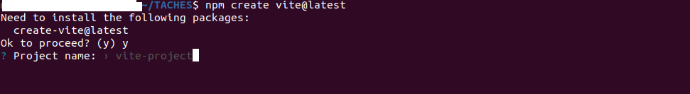
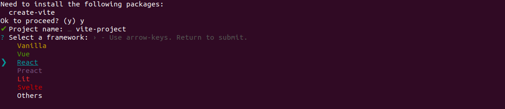
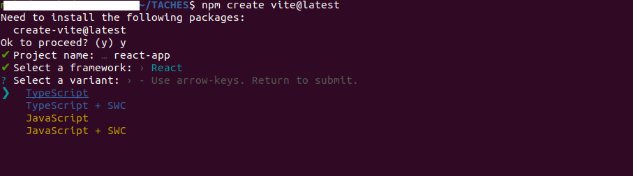

## What is Vite ?

<a href="https://vitejs.dev/" target="_blank">Vite</a> is a popular build tool designed to work with modern frontend frameworks like React.js. It offers a modern development experience with instant server start and hot module replacement (HMR), making development faster and more efficient. Vite also allows for easy configuration and customization, giving you more control over your project.

## How About Create-react-app ?

If you're a React developer, you may have used create-react-app in the past to quickly create a new React project. However, this tool is now outdated. It is now recommended to use production-ready frameworks like Vite, Next.js, Gatsby, Remix, etc. These frameworks offer better performance and more flexibility than create-react-app and are designed to work well with React

See here that create-react-app is gone : <a href="https://react.dev/learn/start-a-new-react-project" target="_blank">Start a New React Project - React Dev</a>

We'll show you how to create a new React project with Vite and get started with developing your React application. We'll cover everything from installing Vite to building your application for production. So let's get started!

## Create New Project With Vite

To create a new project with Vite, follow the steps below:

### Prerequisites

- Node.js and npm: Vite requires Node.js and npm to be installed on your system. You can download Node.js from the official website: https://nodejs.org/en/. npm is included with Node.js, so you don't need to install it separately.

- A code editor: You'll need a code editor to write and edit your React code. There are many code editors to choose from, but some popular options include Visual Studio Code, Sublime Text, and Atom.

-Familiarity with React: While this guide will cover the basics of creating a React project with Vite, it assumes some familiarity with React. If you're new to React, you may want to check out the [React documentation](/react/) first

### To create a new React.js project

1. Go to the directory where you want to start the project and open a terminal or command prompt.

2. Run the command `npm create vite@latest`.

```bash
npm create vite@latest
```

3. It will prompt you to install the create-vite@latest package, so type "y".
4. Type the project name and press Enter.



5. After typing the project name and pressing Enter, you will be prompted to select a framework. In your case, use the arrow keys to select "React" and press Enter.



6. After selecting the React framework, you will be prompted to select a variant. Use the arrow keys to select one of the following options: _TypeScript_, _TypeScript + SWC_, _JavaScript_, or _JavaScript + SWC_. Once you have made your selection, press Enter.



### Install packages

After selecting the variant, go to the newly created directory by running the command:

```bash
cd <project-name> //
```

Then, install all packages by running either of the following commands depending on whether you are using npm or Yarn:

For npm users:

```bash
npm install
```

or

```bash
yarn
```

Next, start the development server by running the following command:

```bash
npm run dev

// or

yarn dev
```

This will start Vite's development server and open your project in the browser. You should see the "Hello, World!" message displayed in the browser.

Go to http://localhost:5173/ to see your app.

Congratulations! You have successfully created a new React project with Vite and rendered your first React component. You can now start building your React application!

## Start editing

Now you can start to make a change, go to `src/App.(jsx|tsx)` to start editing and see change

And that's it! Your new project is now created

## Build Vite Project

Open a terminal or command prompt.

Navigate to your project directory using the following command:

```bash
cd my-react-project
```

Replace "`my-react-project`" with the name of your project directory.

Run the following command to build your project for production:

```bash
npm run build

// or

yarn build
```

This will create a new `dist` directory in your project directory with your optimized production build.

You can test your production build by serving it with a web server. You can use any web server of your choice. One simple option is to use `http-server`, which you can install by running the following command:

```bash
npm install -g http-server
```

Once `http-server` is installed, navigate to the dist directory using the following command:

```bash
cd dist
```

Start the web server by running the following command:

```bash
http-server
```

This will start the web server and display a URL that you can open in your browser to view your production build.

Congratulations! You have successfully built your React project for production using Vite. You can now deploy your optimized build to a web server and share your React application with the world!

## Vite and Its Advantages

Vite is a modern build tool that is designed to work with modern frontend frameworks like React.jd, Vue.js, and others. It was created to address some of the limitations and performance issues with traditional build tools like Webpack and Rollup.

Here are some advantages of using Vite over other build tools:

- Faster development server: Vite's development server is fast, and provides an instant server start, which means that you can see the changes you make to your code almost instantly. This is made possible by Vite's use of ES modules, which allows it to skip the bundling step during development.

- Hot module replacement (HMR): Vite provides hot module replacement , which means that when you make changes to your code, only the affected module is reloaded instead of the entire page. This leads to a faster development experience and quicker feedback loops.

- Customizable configuration: Vite allows you to customize the build configuration easily. This gives you more control over your project, and lets you optimize your build for specific use cases.

- Support for modern JavaScript features: Vite supports modern JavaScript features out-of-the-box, like dynamic import and import maps, which can lead to more efficient code and faster loading times.

- Built-in plugins: Vite comes with built-in plugins for popular frontend frameworks like React and Vue, which means that you can start using Vite with your favorite framework quickly and easily.

- Vite also supports other modern web technologies such as CSS pre-processors, CSS modules, and bundling of assets like images and fonts. Vite's ability to handle these technologies in a performant and efficient manner is one of its strengths. Additionally, Vite is designed to work seamlessly with popular JavaScript tools and libraries, such as TypeScript and ESLint. This makes it easy to integrate Vite into your existing development workflow.

Overall, Vite offers a faster and more efficient development experience, and gives you more control over your project's configuration. This makes it a great choice for modern web development with frameworks like React.

